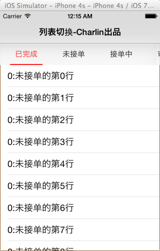
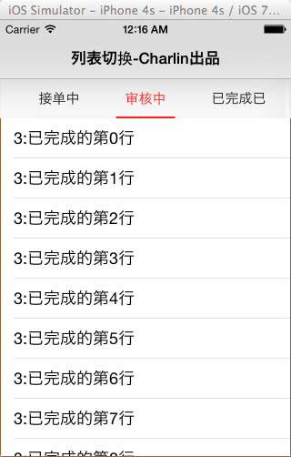
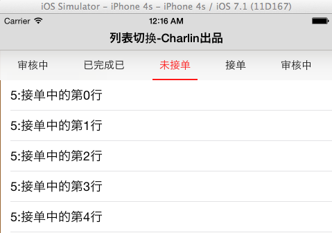
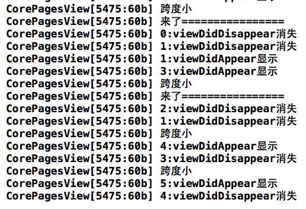

    Charlin出框架的目标：简单、易用、实用、高度封装、绝对解耦！

# CorePagesView
    列表滚动视图，性能王者！
 
####框架说明：
    .本框架主要是为了解决类似以下界面的而生：
    .网易新闻列表
    .越狱版的同步推（没越狱的没用过，不知道是不是一样的）
    .还有我自己做的项目如铁路wifi，车联网都使用到了这样的界面
    .等等，这种需求非常常见。
    大概的界面是：一个页面需要左右滑动，切换子控制器，同时顶部有tab标题，点击也可以滑动到对应的页面。
####框架来由：
    为什么要写这个框架，感觉功能不是很多啊？
    首先要说的是这个需求其实是非常复杂的，我写的这个框架有上千行代码，里面有很多细节是需要注意的
    2.1 子控制器的数量不是固定的，这个需求有3个，下一个需求有4个。甚至网易新闻那种可定制化菜单，数量是不确定的。
    2.2 由于数量不确定，所以对整个需求加大了难度，同时如果像网易那种，有十来个子控制器，如果你敢一个全部加载，只能引发内存问题，我之前做了一个项目叫铁路wifi，有8个新闻栏目同时加载，在iphone 4上面直接卡死8秒左右才有反应。
    2.3 你仔细观察网易新闻，你会发现当点击tab切换，3分钟左右会触发新闻列表页面的刷新，当然这个新闻页面的刷新绝对不是本框架去关心的，这个是属性CoreList类型的加载框架应该做的事情，换句话说，为了解耦，你点击切换tab，只有在一种情况下才能触发，那就是触发子控制器的生命周期方法如viewDidAppear: 和 viewDidDisappear:,同时也涉及性能问题，我们需要动态添加和移除子视图。这个也是比较复杂的。同时添加和移除需要考虑很多问题，如子列表的位置，比如移除前子列表是一个tableView显示在第20行，移除添加之后最好还是在这个位置，给人一种没有动过的感觉。 
    2.4 对于顶部的菜单来说，也有很多种样式，有的是一个按钮就很宽的，有的是图片加文字，有的是居中但是不是很宽，所以这些都是可以封装的，同时也是可以自定义修改的。
    2.5 scrollView的滚动切换与点击tab的切换是逻辑的，是可以封装的，同时如果顶部菜单数量过多，还需要动态调整让当前显示在中间。这些都是可以封装起来的。
    2.6 需要考虑屏幕旋转及横竖屏的问题。
    
####项目解析
    本框架写了一周左右（我正在做车联网，写框架的时间不是很多），写框架的时间考虑的问题还是算比较全面，下面就对如果自定义出你想要的样式，核心思想、重要代码以及使用做出一个解释。  
    
    3.1.如果集成： 
    CorePagesView是一个view，他需要一个配置模型数组，传入模型数组即可完成安装：
      -(CorePagesView *)pagesView{
    
    if(_pagesView==nil){
        //index以及title属性是模拟数据，并非框架使用。
        OrderListTVC *list0TVC=[[OrderListTVC alloc] initWithStyle:UITableViewStylePlain];
        list0TVC.index=0;
        list0TVC.titleStr=@"未接单"; 
        
        OrderListTVC *list1TVC=[[OrderListTVC alloc] initWithStyle:UITableViewStylePlain];
        list1TVC.index=1;
        list1TVC.titleStr=@"接单中";
        
        OrderListTVC *list2TVC=[[OrderListTVC alloc] initWithStyle:UITableViewStylePlain];
        list2TVC.index=2;
        list2TVC.titleStr=@"审核中";
        
        OrderListTVC *list3TVC=[[OrderListTVC alloc] initWithStyle:UITableViewStylePlain];
        list3TVC.index=3;
        list3TVC.titleStr=@"已完成";
        
        OrderListTVC *list4TVC=[[OrderListTVC alloc] initWithStyle:UITableViewStylePlain];
        list4TVC.index=4;
        list4TVC.titleStr=@"未接单";
        
        OrderListTVC *list5TVC=[[OrderListTVC alloc] initWithStyle:UITableViewStylePlain];
        list5TVC.index=5;
        list5TVC.titleStr=@"接单中";
        
        OrderListTVC *list6TVC=[[OrderListTVC alloc] initWithStyle:UITableViewStylePlain];
        list6TVC.index=6;
        list6TVC.titleStr=@"审核中";
        
        OrderListTVC *list7TVC=[[OrderListTVC alloc] initWithStyle:UITableViewStylePlain];
        list7TVC.index=7;
        list7TVC.titleStr=@"已完成";
        
        CorePageModel *model0=[CorePageModel model:list0TVC pageBarName:@"已完成"];
        CorePageModel *model1=[CorePageModel model:list1TVC pageBarName:@"未接单"];
        CorePageModel *model2=[CorePageModel model:list2TVC pageBarName:@"接单中"];
        CorePageModel *model3=[CorePageModel model:list3TVC pageBarName:@"审核中"];
        CorePageModel *model4=[CorePageModel model:list4TVC pageBarName:@"已完成已"];
        
        CorePageModel *model5=[CorePageModel model:list5TVC pageBarName:@"未接单"];
        CorePageModel *model6=[CorePageModel model:list6TVC pageBarName:@"接单"];
        CorePageModel *model7=[CorePageModel model:list7TVC pageBarName:@"审核中"];
        
        
        NSArray *pageModels=@[model0,model1,model2,model3,model4,model5,model6,model7];

        _pagesView=[CorePagesView viewWithOwnerVC:self pageModels:pageModels];
    }
    
        return _pagesView;
    }

    控制器直接添加此view即可。

    3.2 实例化方法说明：
     /**
     *  快速实例化对象
     *
     *  @param ownerVC    本视图所属的控制器
     *  @param pageModels 模型数组
     *
     *  @return 实例
     */
    +(instancetype)viewWithOwnerVC:(UIViewController *)ownerVC pageModels:(NSArray *)pageModels;

    3.3如何配置出你想要的样式？
     /**
     *  动态值：动态值主要是用于设备判断，当tab数量较少，需要以设备来决定宽度时使用
     */
    
    /**
     *  顶部按钮的基本宽度
     */
    #define CorePagesBarBtnWidth 100
    
    
    
    /**
     *  顶部按钮的扩展宽度，可修改下划线的宽度
     */
    #define CorePagesBarBtnExtraWidth 60
    
    
    
    /**
     *  是否使用自定义的宽度，如果不使用，则框架自行计算宽度
     */
    #define CorePagesBarBtnUseCustomWidth NO
    
    
    /**
     *  bar条的高度
     */
    UIKIT_EXTERN CGFloat const CorePagesBarViewH;
    
    
    
    /**
     *  字体大小
     */
    UIKIT_EXTERN CGFloat const CorePagesBarBtnFontPoint;
    
    
    
    /**
     *  顶部菜单最左和最右的间距
     */
    UIKIT_EXTERN CGFloat const CorePagesBarScrollMargin;
    
    
    
    
    /**
     *  菜单按钮之间的间距
     */
    UIKIT_EXTERN CGFloat const CorePagesBarBtnMargin;
    
    
    
    /**
     *  线条多余长度（单边）
     */
    UIKIT_EXTERN CGFloat const CorePagesBarLineViewPadding;
    
    
    
    /**
     *  主体内容区间距值
     */
    UIKIT_EXTERN CGFloat const CorePagesMainViewMargin;
    
    
    
    
    /**
     *  动画时长
     */
    UIKIT_EXTERN CGFloat const CorePagesAnimDuration;

    
    
####.效果图片 
 
 
 
 

  

-----
    CorePagesView 列表滚动视图，性能王者！
-----

  

#### 版权说明 RIGHTS  
作品说明：本框架由iOS开发攻城狮Charlin制作。 
作品时间： 2013.03.25 18:07 

#### 关于Chariln INTRODUCE  
作者简介：Charlin-四川成都华西都市报旗下华西都市网络有限公司技术部iOS工程师！  

#### 联系方式 CONTACT  
Q    Q：1761904945（请注明缘由） 
Mail：1761904945@qq.com 
